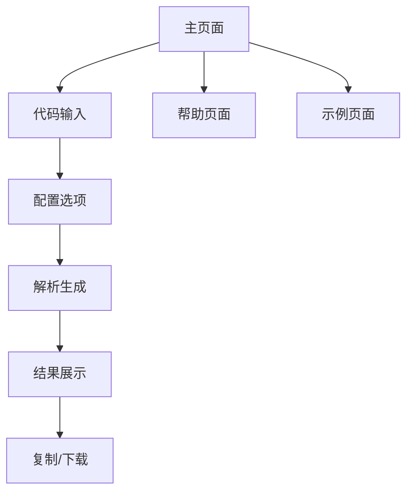

# Java实体类转Apifox规范JSON工具 - 产品需求文档

## 1. 产品概述

本工具旨在解决开发团队使用JetBrains Apifox插件时生成的接口文档注释不全的问题。用户可以输入Java实体类代码，程序自动解析并输出符合Apifox规范的带有完整注释信息的JSON格式文档。

该工具将显著提升API文档的完整性和规范性，减少手动补充注释的工作量，提高开发效率。

## 2. 核心功能

### 2.1 用户角色

| 角色 | 注册方式 | 核心权限 |
|------|----------|----------|
| 开发者 | 无需注册，直接使用 | 可输入Java代码，生成JSON文档，下载结果 |

### 2.2 功能模块

本工具包含以下核心页面：
1. **主页面**：代码输入区域、解析按钮、结果展示区域
2. **帮助页面**：使用说明、Java实体类规范、Apifox JSON格式说明
3. **示例页面**：常见Java实体类示例和对应的JSON输出

### 2.3 页面详情

| 页面名称 | 模块名称 | 功能描述 |
|----------|----------|----------|
| 主页面 | 代码输入区 | 提供代码编辑器，支持Java语法高亮，实时语法检查 |
| 主页面 | 解析引擎 | 解析Java实体类，提取字段信息、注释、类型等 |
| 主页面 | 结果展示区 | 显示生成的Apifox规范JSON，支持格式化、复制、下载 |
| 主页面 | 配置选项 | 设置生成选项如是否包含私有字段、注释风格等 |
| 帮助页面 | 使用指南 | 详细说明工具使用方法和注意事项 |
| 帮助页面 | 格式规范 | 展示Apifox JSON格式要求和字段说明 |
| 示例页面 | 代码示例 | 提供常见Java实体类模板 |
| 示例页面 | 输出示例 | 展示对应的JSON输出结果 |

## 3. 核心流程

用户操作流程如下：
1. 用户访问主页面
2. 在代码输入区粘贴或输入Java实体类代码
3. 可选择配置生成选项（如字段过滤、注释风格等）
4. 点击"解析生成"按钮
5. 系统解析Java代码，提取类信息、字段信息、注释等
6. 生成符合Apifox规范的JSON格式
7. 在结果展示区显示生成的JSON
8. 用户可复制或下载生成的JSON文件

## 4. 用户界面设计

### 4.1 设计风格

- **主色调**：#1890ff（蓝色）、#52c41a（绿色）
- **辅助色**：#f0f0f0（浅灰）、#ffffff（白色）
- **按钮风格**：圆角矩形，悬停效果
- **字体**：主要使用 'SF Pro Display', 'Helvetica Neue', Arial
- **字体大小**：标题 24px，正文 14px，代码 12px
- **布局风格**：左右分栏布局，左侧输入，右侧输出
- **图标风格**：线性图标，简洁现代

### 4.2 页面设计概览

| 页面名称 | 模块名称 | UI元素 |
|----------|----------|--------|
| 主页面 | 顶部导航 | Logo、导航菜单（主页/帮助/示例）、GitHub链接 |
| 主页面 | 代码输入区 | Monaco编辑器，Java语法高亮，行号显示，全屏按钮 |
| 主页面 | 配置面板 | 开关组件，下拉选择，配置项说明 |
| 主页面 | 操作按钮 | 解析按钮（主要），清空按钮（次要），示例按钮 |
| 主页面 | 结果展示区 | JSON编辑器，格式化显示，复制按钮，下载按钮 |
| 帮助页面 | 内容区域 | 分步骤说明，代码示例，注意事项 |
| 示例页面 | 示例列表 | 卡片布局，分类展示，一键导入功能 |

### 4.3 响应式设计

采用移动端优先的响应式设计，支持桌面端和移动端访问。在移动端将左右分栏改为上下布局，确保代码编辑和结果查看的良好体验。