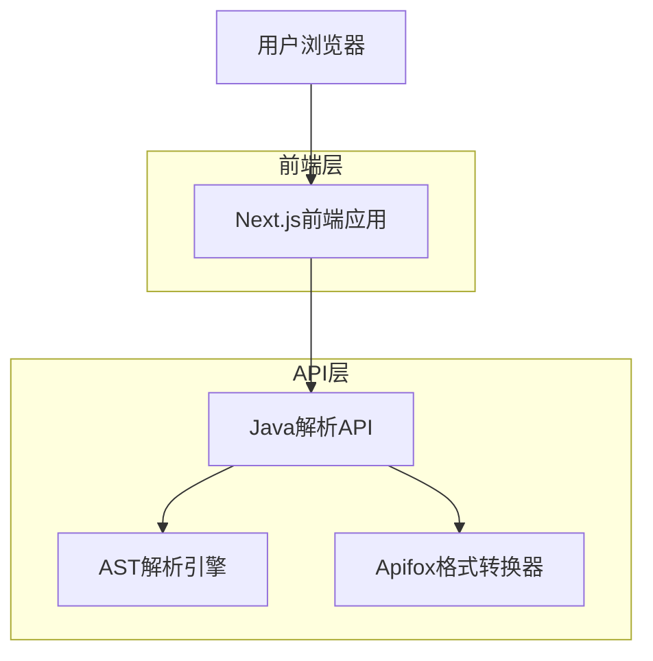
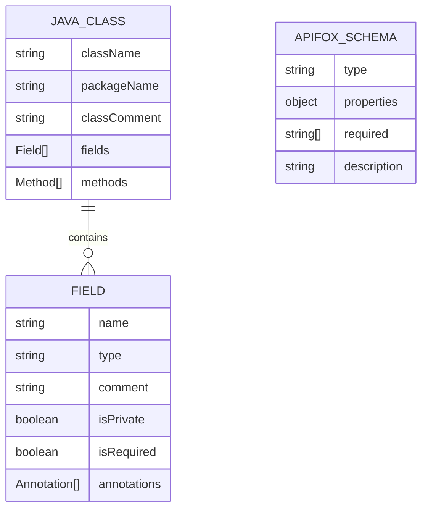

# Java实体类转Apifox规范JSON工具 - 技术架构文档

## 1. 架构设计



## 2. 技术描述

* 前端：Next.js\@14 + React\@18 + TypeScript + Tailwind CSS + Monaco Editor

* 后端：Next.js API Routes

* 解析引擎：自定义Java AST解析器

* 部署：Vercel

## 3. 路由定义

| 路由        | 用途               |
| --------- | ---------------- |
| /         | 主页面，包含代码输入和结果展示  |
| /help     | 帮助页面，使用说明和格式规范   |
| /examples | 示例页面，常见Java实体类示例 |

## 4. API定义

### 4.1 核心API

Java代码解析接口

```
POST /api/parse
```

请求参数：

| 参数名称     | 参数类型         | 是否必需  | 描述         |
| -------- | ------------ | ----- | ---------- |
| javaCode | string       | true  | Java实体类源代码 |
| options  | ParseOptions | false | 解析配置选项     |

响应参数：

| 参数名称    | 参数类型         | 描述              |
| ------- | ------------ | --------------- |
| success | boolean      | 解析是否成功          |
| data    | ApifoxSchema | Apifox规范的JSON数据 |
| error   | string       | 错误信息（如果有）       |

请求示例：

```json
{
  "javaCode": "public class User {\n  private String name;\n  private int age;\n}",
  "options": {
    "includePrivateFields": true,
    "generateExamples": true
  }
}
```

响应示例：

```json
{
  "success": true,
  "data": {
    "type": "object",
    "properties": {
      "name": {
        "type": "string",
        "description": "用户姓名",
        "example": "张三"
      },
      "age": {
        "type": "integer",
        "description": "用户年龄",
        "example": 25
      }
    },
    "required": ["name", "age"]
  }
}
```

获取示例代码接口

```
GET /api/examples
```

响应参数：

| 参数名称     | 参数类型       | 描述     |
| -------- | ---------- | ------ |
| examples | Example\[] | 示例代码列表 |

## 5. 数据模型

### 5.1 数据模型定义



### 5.2 数据定义语言

核心类型定义：

```typescript
// Java解析相关类型
interface JavaClass {
  className: string;
  packageName?: string;
  classComment?: string;
  fields: JavaField[];
  methods?: JavaMethod[];
}

interface JavaField {
  name: string;
  type: string;
  comment?: string;
  isPrivate: boolean;
  isRequired: boolean;
  annotations: JavaAnnotation[];
  defaultValue?: any;
}

interface JavaAnnotation {
  name: string;
  parameters?: Record<string, any>;
}

// Apifox规范类型
interface ApifoxSchema {
  type: 'object' | 'array' | 'string' | 'number' | 'integer' | 'boolean';
  properties?: Record<string, ApifoxProperty>;
  items?: ApifoxSchema;
  required?: string[];
  description?: string;
  example?: any;
}

interface ApifoxProperty {
  type: string;
  description?: string;
  example?: any;
  format?: string;
  enum?: any[];
  minimum?: number;
  maximum?: number;
  pattern?: string;
}

// 解析配置选项
interface ParseOptions {
  includePrivateFields?: boolean;
  generateExamples?: boolean;
  commentStyle?: 'javadoc' | 'inline';
  requiredFieldStrategy?: 'annotation' | 'all' | 'none';
}

// API响应类型
interface ParseResponse {
  success: boolean;
  data?: ApifoxSchema;
  error?: string;
}

interface Example {
  id: string;
  title: string;
  description: string;
  javaCode: string;
  expectedOutput: ApifoxSchema;
}
```

解析引擎核心算法：

```typescript
// Java代码解析流程
class JavaParser {
  parse(javaCode: string, options: ParseOptions): JavaClass {
    // 1. 词法分析 - 将代码分解为tokens
    const tokens = this.tokenize(javaCode);
    
    // 2. 语法分析 - 构建AST
    const ast = this.buildAST(tokens);
    
    // 3. 语义分析 - 提取类信息
    const javaClass = this.extractClassInfo(ast);
    
    return javaClass;
  }
  
  private tokenize(code: string): Token[] {
    // 实现Java代码词法分析
  }
  
  private buildAST(tokens: Token[]): ASTNode {
    // 实现语法树构建
  }
  
  private extractClassInfo(ast: ASTNode): JavaClass {
    // 提取类、字段、注释信息
  }
}

// Apifox格式转换器
class ApifoxConverter {
  convert(javaClass: JavaClass, options: ParseOptions): ApifoxSchema {
    const schema: ApifoxSchema = {
      type: 'object',
      properties: {},
      required: []
    };
    
    // 转换字段为Apifox属性
    javaClass.fields.forEach(field => {
      if (this.shouldIncludeField(field, options)) {
        schema.properties![field.name] = this.convertField(field, options);
        
        if (this.isRequiredField(field, options)) {
          schema.required!.push(field.name);
        }
      }
    });
    
    return schema;
  }
  
  private convertField(field: JavaField, options: ParseOptions): ApifoxProperty {
    // 将Java字段转换为Apifox属性
  }
}
```

